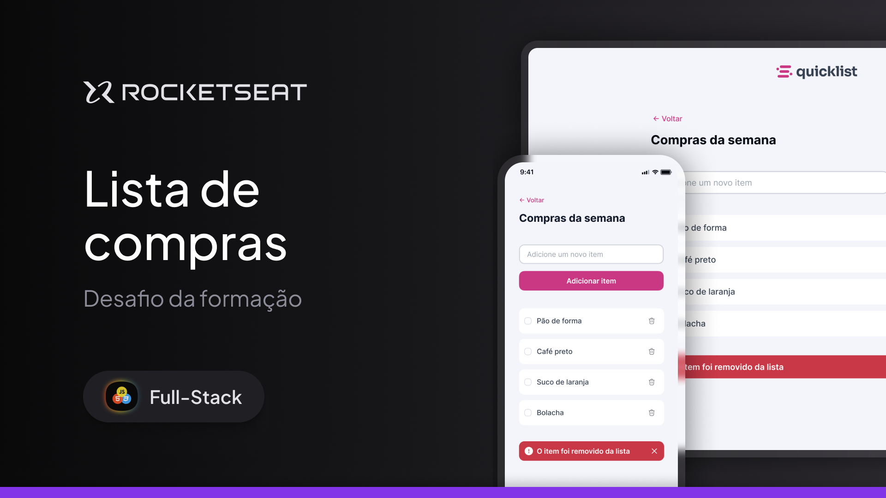

<h1 align="center"> Lista de compras </h1>

Nivel 5 - JavaScript  
Desafio prático 

  <a href="#-tecnologias">Tecnologias</a>&nbsp;&nbsp;&nbsp;|&nbsp;&nbsp;&nbsp;
  <a href="#-layout">Layout</a>&nbsp;&nbsp;&nbsp;|&nbsp;&nbsp;&nbsp;
  <a href="#memo-licença">Licença</a>

  

 

  

## 🚀 Tecnologias

Esse projeto foi desenvolvido com as seguintes tecnologias:

-   HTML e CSS
-   Git e Github
-   Figma

## 🔖 Layout

Gostaria de informar que o acesso ao Figma do meu projeto está restrito exclusivamente aos alunos da Rocketseat. Esta medida é para garantir que os recursos e conteúdos sejam utilizados de forma adequada e por aqueles que fazem parte do programa de ensino.

## :memo: Licença

Esse projeto está sob a licença MIT.

---
